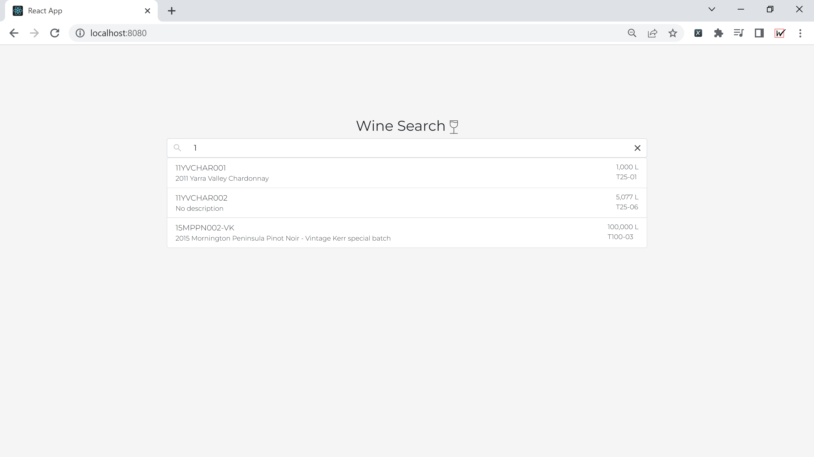
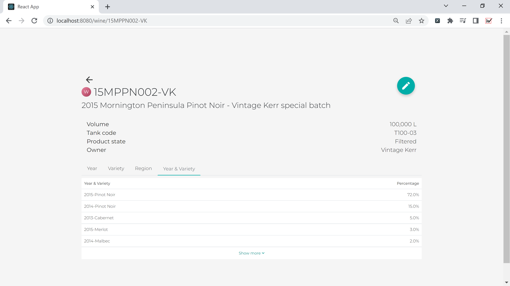

# winecompliance

> This project is an example full stack application for viewing grape breakdowns of different wines. Wine data has been supplied and placed in the serverside/resources/data folder

---

## Project requirements
1. [JDK 1.8](https://www.oracle.com/java/technologies/downloads/) or later
2. [Gradle 4+](https://gradle.org/install/)

## Running Application
The easiest way to run the application is to build and run the jar using the following commands, at the root of the project. 
1. `./gradlew build`
2. `java -jar ./serverside/build/libs/serverside.jar`
3. Navigate to [**http://localhost:8080/**](http://localhost:8080/) in Chrome (or any other modern browser)

## Setup for development
During development it's easier to run the client and server separately. Therefore, navigate to the clientside and serverside folders and run the following commands. 

### Clientside
1. `cd clientside`
2. `npm install`
3. `npm start`

### Serverside
1. `cd serverside`
2. `./gradlew bootRun`

## Assumptions
1. No application security - authentication, authorisation, etc. 
2. No database setup. The data files are loaded into the application at startup
3. Immutable data files during application runtime - if the data files are edited, then the server must be restarted or the jar file recompiled. 
4. Null values are handled by the frontend, not backend. The backend will return null value matching the provided data files. Afterwards, null values will be displayed by the frontend as "No description", "Not provided", etc.  
5. Since the provided data files uses float/double as percentage values, the serverside responses will also use float/double as summarised percentage values. 

## Screenshots 
<figure>
    
    <figcaption>Search Page</figcaption>
</figure>

<figure>
    
    <figcaption>Details Page</figcaption>
</figure>

